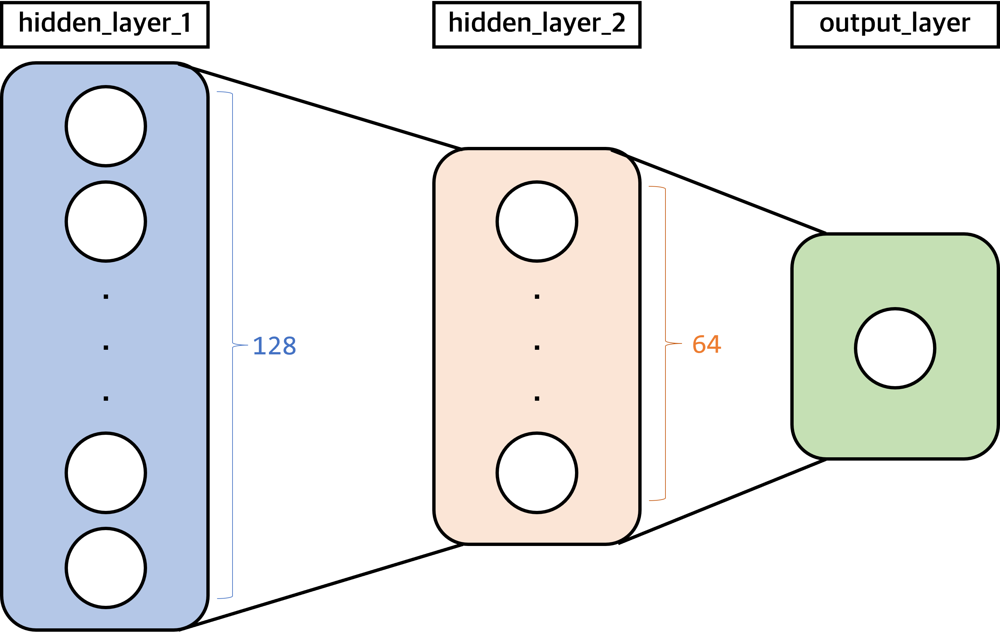
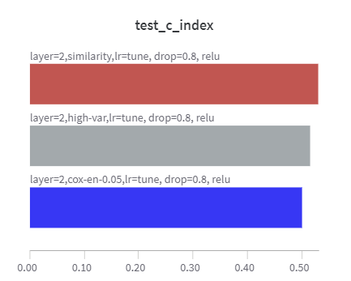
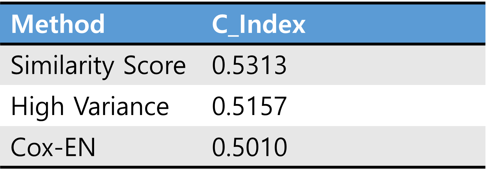
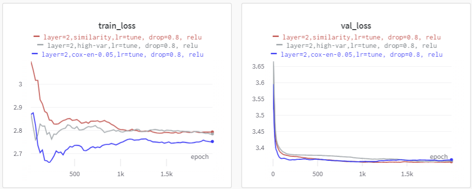

# Similarity Feature Selection for Survival Analysis
- Research codes about new feature selection method with similarity score for Survival Analysis in UNLV short-term research program
- [Yonghwan Lee](https://sites.google.com/view/leeyonghwan/about), Hyojin Yeon, Jihyeon Kwon, Soyeon Bae
- Advisor : [Mingon Kang](http://mkang.faculty.unlv.edu/)

## Task Definition
- Project 4. Deep Learning-Based Survival Analysis Using Genomic Data
- Genomic Data : LGG, GBM Data from [TCGA](https://www.cancer.gov/ccg/research/genome-sequencing/tcga)
- Survival_CostFunc_CIndex.py : Referenced to [Cox-PASNet](https://github.com/DataX-JieHao/Cox-PASNet)
- Datasets : HDLSS -> decreasing dimensions of data(Columns) -> Need Feature Selection
- We proposed new feature selection method with Similarity Score
- We compared ordinary feature selection methods
    - Cox-EN : Selecting by Cox-EN model
    - High Variance : Selecting high variance columns

## Model
- model : Cox-nnet(PyTorch Lightning)
    - layer : 2(input_dim -> 128 -> 64 -> 1)
    - dropout : y
    - activation function : y
    - output layer : bias=False, Non-activation
- metric : C-index(Survival_CostFunc_CIndex.py)
- loss function : Negative log-partial likelihood(Survival_CostFunc_CIndex.py)


## Settings
- Environments
```
pip install -r requirements.txt
```

## Preprocess
- input_path : path for input data
- save_path : path for save data
- method : both(Similarity and Cox-EN), sim(Similarity), cox(Cox-EN)
- cox_ratio : Elasticnet's L1 ratio
- sim_threshold : Select Similarity Columns(Genes) Ratio, 0.6 -> if 60% values of column is larger than 0, we select it!

```
python preprocess.py \
-input_path "./data/result.csv" \
-save_path "./data/" \
-method "both" \
-cox_ratio 0.005 \
-sim_threshold 0.6
```

## Run
- data_path : path for load data
- gpus : Select GPU number, Please input string value like "0" or "1"
- method : similarity(Feature Selected by Similarity Score) or cox_en(Feature Selected by Cox-EN model)
- act_func : Select Activation Function
    - tanh : Hyperbolic tangent
    - sigm : Sigmoid Function
    - relu : ReLU
    - gelu : GELU
    - leak : Leaky ReLU

```
python run.py \
-data_path "./data/" \
-gpus "0" \
-method "similarity" \
-epoch 2000 \
-batch_size 256 \
-dropout_rate 0.8 \
-act_func "relu"
```

# Result
- Our method(Similarity Score) is the highest C_index Score.


- Learning Curb

